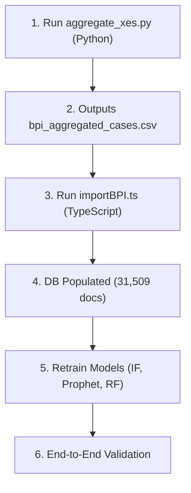

# BPI Challenge 2017 → GovVision Integration Plan

> **Author**: Senior AI/ML Engineer  
> **Dataset**: BPI Challenge 2017 (XES Event Log)  
> **Current State**: 2,500-row synthetic CSV → `m1_decisions` (MongoDB)  
> **Target State**: 31,509 aggregated cases from 1,202,267 real-world events  

---

## 0. Executive Summary

The BPI Challenge 2017 dataset models a **loan application approval process** at a Dutch financial institution. Each "case" is a loan application that flows through creation → validation → offer generation → acceptance/denial.

The migration involves a robust 2-step ETL process followed by model retraining:

| Phase | Deliverable | Estimated Effort |
|-------|-------------|-----------------|
| **Phase 1A** – XES to CSV | `aggregate_xes.py` script → `bpi_aggregated_cases.csv` | Core |
| **Phase 1B** – CSV Ingestion | `importBPI.ts` script → 31,509 `m1_decisions` documents | Core |
| **Phase 2** – Model Retraining | Retrain Isolation Forest, Prophet, Random Forest on real data | Core |
| **Phase 3** – Integration Testing | End-to-end validation, dashboard smoke test | Validation |

---

## 1. Dataset Anatomy (Verified)

**File**: `server/scripts/BPI Challenge 2017.xes`  
**Format**: IEEE XES 1.0 (XML-based event log)

```
Total traces (cases):   31,509
Total events:           1,202,267
Avg events per case:    ~38
Date range:             Jan 2016 – Feb 2017
```

### 1.1 Trace-Level Attributes (per case)
| XES Key | Example Value | Maps To |
|---------|--------------|---------|
| `concept:name` | `Application_652823628` | Case ID (grouping key) |
| `RequestedAmount` | `20000.0` | `priority` (binned) |
| `ApplicationType` | `New credit` | Random Forest feature |

### 1.2 Event-Level Attributes (per row)
| XES Key | Example Value | Maps To |
|---------|--------------|---------|
| `concept:name` | `A_Create Application` | Activity name |
| `time:timestamp` | `2016-01-01T09:51:15.304Z` | `createdAt` / `completedAt` |
| `org:resource` | `User_1` | `departmentId` mapping |

### 1.3 Unique Activities (24 total)
- **Application Events**: `A_Create Application`, `A_Accepted`, `A_Denied`, `A_Cancelled`, etc.
- **Offer Events**: `O_Create Offer`, `O_Refused`, etc.
- **Workflow Events**: `W_Handle leads`, `W_Validate application`, etc.

---

## 2. Phase 1: ETL — Two-Step Pipeline

### 2.1 Architecture Decision
Parsing a 130MB XML file directly in Node.js using state machines is slow, memory-intensive, and prone to silent data-loss bugs. We will implement a **Two-Step Pipeline**:
1. **Python Pre-processing (`aggregate_xes.py`)**: Parses the `.xes` XML, flattens traces, handles complex status/time calculations, and exports a flat `bpi_aggregated_cases.csv`.
2. **TypeScript Ingestion (`importBPI.ts`)**: A COMPLETELY NEW import logic that reads the pre-aggregated CSV, maps timestamps to the 2025/2026 dashboard window, assigns departments, and performs batch insertion into MongoDB.

### 2.2 Phase 1A: Python XES → CSV Extraction (`aggregate_xes.py`)

The Python script (`server/scripts/aggregate_xes.py`) will use `xml.etree.ElementTree` `iterparse` for memory-efficient streaming. 

**Extraction Rules (per case):**
- `createdAt`: `min(time:timestamp)`
- `completedAt`: `max(time:timestamp)`
- `cycleTimeHours`: `(completedAt - createdAt) / 3600`
- `revisionCount`: Count of `O_Create Offer` events minus 1 (min 0)
- `rejectionCount`: Count of `O_Refused` + `A_Denied` events
- `stageCount`: Count of unique `W_*` activities
- `status`: Determined by the **chronologically last** `A_*` event (`A_Denied`/`A_Cancelled` = rejected, `A_Complete`/`A_Accepted` = approved, else pending).
- `priority`: Binned from `RequestedAmount`
- `resource`: `org:resource` of the first event (for department mapping)

### 2.3 Phase 1B: TypeScript CSV → MongoDB (`importBPI.ts`)

Create `server/scripts/importBPI.ts` to handle ingestion. It reads `bpi_aggregated_cases.csv` and applies the final database preparations:

**1. Department Mapping Strategy:**
The BPI dataset uses ~145 `User_*` IDs. We deterministically hash-bucket them into GovVision's 5 canonical departments (`Finance`, `HR`, `Operations`, `IT`, `CS`) so that `User_1` always maps to the same department.

**2. Time Remapping:**
Linearly map the `2016-2017` timestamps into the dashboard's `Jan 2025 – Mar 2026` window.

**3. Calibrated SLA Threshold (CRITICAL FIX):**
The original 48-hour SLA caused 95% of real-world cases to be flagged as "Critical Risk" because real loans take weeks. We will adjust the SLA threshold to **21 Days (504 hours)** to accurately reflect the dataset.
```typescript
const SLA_HOURS = 504 // 21 days for real-world loan applications
const daysOverSLA = Math.max(0, (cycleTimeHours - SLA_HOURS) / 24)
```

**4. Batch Insertion:**
Insert documents into MongoDB in chunks of 500.

---

## 3. Phase 2: Model Retraining

### 3.1 Isolation Forest (Anomaly Detection)
**Script**: `ml_service/training/train_isolation_forest.py`
- **Action**: Retrain on the new real-world distributions.
- **Adjustment**: Reduce `contamination` from `0.06` to `0.02`. Real BPI data has extreme natural variance; we don't want to over-flag anomalies simply because a loan took a long time legitimately.

### 3.2 Prophet (Delay Forecasting)
**Script**: `ml_service/training/train_prophet.py`
- **Action**: Retrain without code changes. The new 14-month date range will provide excellent yearly + weekly seasonality patterns.

### 3.3 Random Forest (Risk Scoring)
**Script**: `ml_service/training/train_risk_model.py`
- **Action**: **REWRITE REQUIRED.** Must be rewritten to stop using synthetic data.
- **New Labels**: `is_at_risk = 1` if `daysOverSLA > 0 OR status == 'rejected'`
- **New Features**: `departmentId`, `priority`, `hourOfDaySubmitted`, `revisionCount`, `stageCount`.

---

## 4. Execution Order


