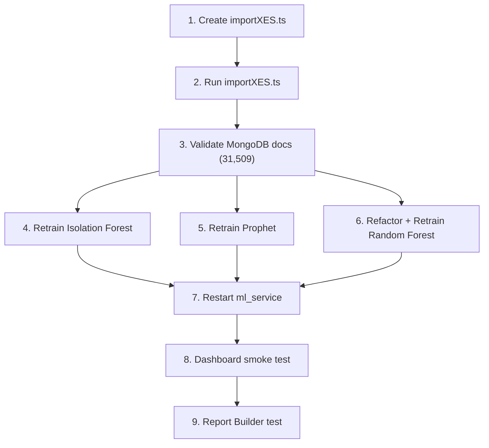

# BPI Challenge 2017 → GovVision Integration Plan

> **Author**: Senior AI/ML Engineer  
> **Dataset**: BPI Challenge 2017 (XES Event Log)  
> **Current State**: 2,500-row  CSV → `m1_decisions` (MongoDB)  
> **Target State**: 31,509 aggregated cases from 1,202,267 real-world events  

---

## 0. Executive Summary

The BPI Challenge 2017 dataset models a **loan application approval process** at a Dutch financial institution. Each "case" is a loan application that flows through creation → validation → offer generation → acceptance/denial — a pattern that maps cleanly onto GovVision's government decision-approval model.

The migration involves three phases:

| Phase | Deliverable | Estimated Effort |
|-------|-------------|-----------------|
| **Phase 1** – ETL | `importXES.ts` script → 31,509 `m1_decisions` documents | Core |
| **Phase 2** – Model Retraining | Retrain Isolation Forest, Prophet, Random Forest on real data | Core |
| **Phase 3** – Integration Testing | End-to-end validation, dashboard smoke test | Validation |
---

## 1. Dataset Anatomy (Verified)

**File**: `server/scripts/BPI Challenge 2017.xes`  
**Format**: IEEE XES 1.0 (XML-based event log)

```
Total traces (cases):   31,509
Total events:           1,202,267
Avg events per case:    ~38
Date range:             Jan 2016 – Feb 2017
```

### 1.1 Trace-Level Attributes (per case)
| XES Key | Example Value | Maps To |
|---------|--------------|---------|
| `concept:name` | `Application_652823628` | Case ID (grouping key) |
| `RequestedAmount` | `20000.0` | `priority` (binned) |
| `LoanGoal` | `Existing loan takeover` | Metadata (not used in ML features) |
| `ApplicationType` | `New credit` | Random Forest feature |

### 1.2 Event-Level Attributes (per row)
| XES Key | Example Value | Maps To |
|---------|--------------|---------|
| `concept:name` | `A_Create Application` | Activity name |
| `time:timestamp` | `2016-01-01T09:51:15.304Z` | `createdAt` / `completedAt` |
| `org:resource` | `User_1` | `departmentId` mapping |
| `Action` | `Created`, `statechange` | Status derivation |
| `EventOrigin` | `Application`, `Offer`, `Workflow` | Classification |
| `lifecycle:transition` | `complete`, `schedule` | Event lifecycle |

### 1.3 Unique Activities (24 total)

**Application Events** (status-determining):
- `A_Create Application`, `A_Submitted`, `A_Concept`, `A_Accepted`, `A_Complete`
- `A_Validating`, `A_Incomplete`, `A_Pending`
- `A_Denied`, `A_Cancelled` ← **terminal rejection states**

**Offer Events** (revision/rejection signals):
- `O_Create Offer`, `O_Created`, `O_Sent (mail and online)`, `O_Sent (online only)`
- `O_Accepted`, `O_Refused`, `O_Returned`, `O_Cancelled`

**Workflow Events** (process stages):
- `W_Handle leads`, `W_Complete application`, `W_Call incomplete files`
- `W_Validate application`, `W_Assess potential fraud`, `W_Call after offers`

### 1.4 Unique Resources
- 145+ unique `User_*` IDs (e.g. `User_1` through `User_145`)
- These will be mapped to GovVision's 5 canonical departments via hash-bucketing

---

## 2. Phase 1: ETL — `importXES.ts`

### 2.1 Architecture Decision

Create a **new standalone script** `server/scripts/importXES.ts` that mirrors the structure of the existing `importCSV.ts`. This avoids regression risk to the working CSV importer while reusing the same MongoDB connection pattern, department mapping, and enrichment logic.

### 2.2 XES Parsing Strategy

The XES file is ~130MB of XML. We'll use Node.js **streaming SAX parsing** via `sax` (lightweight, no DOM) to avoid loading the entire file into memory.

```
npm install sax @types/sax --save-dev
```

**Parser state machine**:
```
IDLE → TRACE_OPEN → (collect trace attributes)
    → EVENT_OPEN → (collect event attributes) → EVENT_CLOSE
    → ... more events ...
    → TRACE_CLOSE → aggregate → push document
```

### 2.3 Aggregation Rules (Case → Document)

For each trace (grouped by `concept:name`):

| Target Field | Aggregation Logic | BPI Source |
|-------------|-------------------|------------|
| `createdAt` | `min(time:timestamp)` across all events | First event timestamp |
| `completedAt` | `max(time:timestamp)` across all events | Last event timestamp |
| `cycleTimeHours` | `(completedAt - createdAt) / 3600000` | Computed |
| `status` | Derived from terminal activity (see §2.4) | Last `A_*` event |
| `revisionCount` | `count(O_Create Offer) - 1` (min 0) | Offer creation events |
| `rejectionCount` | `count(O_Refused) + count(A_Denied)` | Refusal/denial events |
| `stageCount` | Count of unique `W_*` activity types | Workflow stage diversity |
| `daysOverSLA` | `max(0, (cycleTimeHours - SLA_THRESHOLD) / 24)` | Computed (SLA = 48h) |
| `hourOfDaySubmitted` | `createdAt.getUTCHours()` | First event hour |
| `departmentId` | Hash-bucket `org:resource` of first event → 5 depts | Resource mapping |
| `departmentName` | Canonical name from department mapping | Derived |
| `priority` | Bin `RequestedAmount`: <10k=low, 10k-30k=medium, >30k=high | Trace attribute |

### 2.4 Status Derivation Rules

```typescript
function deriveStatus(events: EventData[]): "approved" | "rejected" | "pending" {
  // Sort events chronologically
  const sorted = [...events].sort((a, b) => a.timestamp - b.timestamp)

  // Find the LAST application-level event
  const lastAppEvent = sorted
    .filter(e => e.activityName.startsWith("A_"))
    .pop()

  if (!lastAppEvent) return "pending"

  // Terminal rejection states
  if (lastAppEvent.activityName === "A_Denied")    return "rejected"
  if (lastAppEvent.activityName === "A_Cancelled")  return "rejected"

  // Terminal approval states
  if (lastAppEvent.activityName === "A_Complete")   return "approved"
  if (lastAppEvent.activityName === "A_Accepted")   return "approved"

  // If O_Accepted exists without denial, treat as approved
  if (sorted.some(e => e.activityName === "O_Accepted")) return "approved"

  // Everything else is pending/in-progress
  return "pending"
}
```

### 2.5 Department Mapping Strategy

The BPI dataset has ~145 `User_*` resources (no inherent department hierarchy). We'll deterministically distribute them across GovVision's 5 canonical departments using a stable hash:

```typescript
const DEPARTMENTS = [
  { departmentId: "FI001", departmentName: "Finance" },
  { departmentId: "HR002", departmentName: "Human Resources" },
  { departmentId: "OP003", departmentName: "Operations" },
  { departmentId: "IT004", departmentName: "Information Technology" },
  { departmentId: "CS005", departmentName: "Customer Service" },
]

function mapResourceToDepartment(resource: string): DepartmentMeta {
  // Stable hash so same User_X always maps to same department
  let hash = 0
  for (let i = 0; i < resource.length; i++) {
    hash = (hash * 31 + resource.charCodeAt(i)) & 0x7FFFFFFF
  }
  return DEPARTMENTS[hash % DEPARTMENTS.length]
}
```

### 2.6 Time Remapping

The BPI dataset spans **Jan 2016 – Feb 2017**. We'll remap timestamps to **Jan 2025 – Mar 2026** to align with the dashboard's current time window (matching `importCSV.ts` behavior):

```typescript
const SOURCE_MIN = Date.UTC(2016, 0, 1)   // Jan 1, 2016
const SOURCE_MAX = Date.UTC(2017, 1, 28)   // Feb 28, 2017
const TARGET_MIN = Date.UTC(2025, 0, 1)    // Jan 1, 2025
const TARGET_MAX = Date.UTC(2026, 2, 15)   // Mar 15, 2026
```

The linear interpolation from `importCSV.ts` (`mapStartTimeToTargetWindow`) will be reused directly.

### 2.7 SLA Threshold

We'll set a **48-hour SLA threshold**, which is realistic for government approval workflows:

```typescript
const SLA_HOURS = 48
const daysOverSLA = Math.max(0, (cycleTimeHours - SLA_HOURS) / 24)
```

### 2.8 Batch Insertion

Insert in batches of **500 documents** (up from 100 in CSV importer) since we have 31k docs:

```typescript
const BATCH_SIZE = 500
```

### 2.9 Script Execution

```bash
cd server
npx ts-node scripts/importXES.ts
```

**Expected output**:
```
Connected to MongoDB
Parsing XES file...
Parsed 31,509 traces with 1,202,267 events
Cleared existing m1_decisions collection
Inserted 31,509 documents (63 batches)
Department distribution:
  Finance:                  ~6,300
  Human Resources:          ~6,300
  Operations:               ~6,300
  Information Technology:   ~6,300
  Customer Service:         ~6,300
```

---

## 3. Phase 2: Model Retraining

### 3.1 Isolation Forest (Anomaly Detection)

**Script**: `ml_service/training/train_isolation_forest.py`  
**Changes needed**: **None** — the script already reads from `m1_decisions` and trains on the full dataset.

**Expected behavioral changes with BPI data**:
- Feature distributions will be fundamentally different (real vs synthetic)
- `cycleTimeHours` range: likely 0.01 – 2000+ hours (some cases span months)
- `rejectionCount`: 0–5+ (real refusal patterns)
- `revisionCount`: 0–8+ (multiple offer rounds)
- Contamination at 0.06 should still work, but may need tuning based on score distribution

**Retraining command**:
```bash
cd ml_service
python training/train_isolation_forest.py
```

### 3.2 Prophet (Delay Forecasting)

**Script**: `ml_service/training/train_prophet.py`  
**Changes needed**: **None** — the script reads from `m1_decisions`, groups by `department`/`departmentId`/`departmentName`, and trains per-department + org-level models.

**Expected behavioral changes**:
- 14-month time span provides strong yearly + weekly seasonality signals
- Daily volume: ~75 cases/day average (vs ~5/day with 2,500 rows)
- Prophet will identify real business-day patterns (weekday vs weekend)

**Retraining command**:
```bash
cd ml_service
python training/train_prophet.py
```

### 3.3 Random Forest (Risk Scoring)

**Script**: `ml_service/training/train_risk_model.py`  
**Changes needed**: **YES — Major refactor required**

The current script uses a **synthetic feature set** (`violationCount`, `openViolationRate`, `complianceRate`, etc.) that doesn't exist in `m1_decisions`. It must be rewritten to:

1. **Pull from MongoDB** (like the other trainers)
2. **Use BPI-derived features**: `departmentId`, `priority`, `hourOfDaySubmitted`, `revisionCount`, `stageCount`
3. **Create supervised labels**: `is_at_risk = 1` if `daysOverSLA > 0 OR status == 'rejected'`
4. **One-hot encode categoricals**: department, priority
5. **80/20 stratified split** with F1-score evaluation

**Refactored feature set**:
```python
CATEGORICAL_COLS = ["departmentId", "priority"]
NUMERIC_COLS = ["hourOfDaySubmitted", "revisionCount", "stageCount"]
```

**Label creation**:
```python
df["is_at_risk"] = (
    (df["daysOverSLA"] > 0) | (df["status"] == "rejected")
).astype(int)
```

**Retraining command**:
```bash
cd ml_service
python training/train_risk_model.py
```

---

## 4. Phase 3: Integration & Validation

### 4.1 Schema Compatibility Checklist

| m1Decisions Field | BPI Mapping | Status |
|-------------------|-------------|--------|
| `status` | ✅ Derived from terminal A_* events | Compatible |
| `department` | ⚠️ Not set in schema but `departmentId`/`departmentName` are | Compatible (Prophet handles fallback) |
| `createdAt` | ✅ min(timestamp) remapped | Compatible |
| `completedAt` | ✅ max(timestamp) remapped | Compatible |
| `cycleTimeHours` | ✅ Computed from timestamps | Compatible |
| `rejectionCount` | ✅ Count of refusal events | Compatible |
| `revisionCount` | ✅ Count of offer creation events | Compatible |
| `daysOverSLA` | ✅ Computed from cycleTimeHours | Compatible |
| `stageCount` | ✅ Count of unique workflow stages | Compatible |
| `hourOfDaySubmitted` | ✅ UTC hour of first event | Compatible |
| `departmentName` | ✅ Canonical name from hash-bucket | Compatible |
| `priority` | ✅ Binned from RequestedAmount | Compatible |

### 4.2 Dashboard Smoke Test Plan

After ETL + model retraining, verify:

1. **Main Dashboard KPIs**: Total decisions, approval rate, avg cycle time populate correctly
2. **Department Filters**: All 5 departments show data, "Organization Wide" aggregates correctly
3. **Date Range**: Verify data appears in Jan 2025 – Mar 2026 window
4. **Anomaly Detection**: API endpoint `/api/anomaly/detect` returns valid scores
5. **Forecast Charts**: Prophet forecasts render with new time series
6. **Report Builder**: PDF/CSV export contains BPI-derived data

### 4.3 Validation Queries

```javascript
// Verify document count
db.m1_decisions.countDocuments()
// Expected: 31,509

// Verify status distribution
db.m1_decisions.aggregate([
  { $group: { _id: "$status", count: { $sum: 1 } } }
])

// Verify department distribution
db.m1_decisions.aggregate([
  { $group: { _id: "$departmentName", count: { $sum: 1 } } }
])

// Verify date range
db.m1_decisions.aggregate([
  { $group: { _id: null, min: { $min: "$createdAt" }, max: { $max: "$createdAt" } } }
])
```

---

## 5. Execution Order



---

## 6. Critical Assessment & Risks

### ✅ What the BPI Plan Gets Right

1. **Aggregation approach is sound** — Grouping 1.2M events by case ID into 31k documents is the correct methodology. The `m1_decisions` schema maps naturally to this aggregated format.

2. **Model selection is appropriate** — Isolation Forest for unsupervised anomaly detection, Prophet for time-series forecasting, and Random Forest for supervised risk scoring are all well-suited to this data size and structure.

3. **Feature vector is correct** — `[cycleTimeHours, rejectionCount, revisionCount, daysOverSLA, stageCount]` captures the key process performance indicators from the BPI workflow.

4. **Temporal split for Prophet** — Using chronological (not random) split for time-series is the correct approach.

### ⚠️ Areas of Concern

1. **Department Mapping is Synthetic**  
   The BPI dataset has no natural department hierarchy — `User_*` IDs are individual employees. Hash-bucketing into 5 departments creates an **artificial grouping** that has no semantic meaning. This means:
   - Per-department Prophet models will forecast on arbitrary groupings
   - Department-level KPIs in the dashboard are statistically meaningless
   - **Mitigation**: This is acceptable for a demonstration system. Document the synthetic nature clearly.

2. **Cycle Time Distribution is Extreme**  
   Some BPI cases span **months** (2000+ hours). The existing Isolation Forest sanity profiles assume max ~148 hours. With real data:
   - The score distribution will shift dramatically
   - The 0.06 contamination rate may need adjustment
   - **Mitigation**: Let the model self-calibrate on real distributions; monitor Chart 1 output.

3. **Missing `enrichOriginalDistribution`**  
   The CSV importer applies stochastic enrichment to create variance. The XES importer should **NOT** apply this — the BPI data already has natural variance from 31,509 real cases.

4. **`daysOverSLA` Requires an SLA Definition**  
   The BPI dataset has no inherent SLA. The 48-hour threshold is an assumption. Different thresholds will produce very different risk labels for the Random Forest.
   - **Mitigation**: Document the chosen SLA. Consider making it configurable via `.env`.

5. **Status Mapping Ambiguity**  
   Some cases may have **both** `A_Accepted` and `A_Denied` events (if the application was initially denied, then resubmitted and accepted). The terminal-state logic must use the **chronologically last** application-level event, not just check for existence.
   - **Mitigation**: Sort events by timestamp, take the last `A_*` event as the terminal status.

6. **Random Forest Feature Poverty**  
   The BPI plan suggests `departmentId`, `priority`, `hourOfDaySubmitted`, and `ApplicationType` as features. With hash-bucketed departments and only 3 priority bins, the feature space is thin.
   - **Mitigation**: Add `stageCount` and `revisionCount` as numeric features to give the model more signal.

7. **Memory Pressure During XES Parsing**  
   1,202,267 events in a SAX parser is manageable, but accumulating all 31,509 aggregated documents in-memory before batch insertion requires ~50MB. This is fine for a script but would be problematic for a web endpoint.
   - **Mitigation**: Flush every 1,000 documents during insertion (already planned with batch strategy).

### ❌ Gaps in the Original Proposal

1. **No mention of time remapping** — The BPI data is from 2016-2017 but the dashboard expects 2025 data. The original `bpi.txt` plan doesn't address this.

2. **No XES parsing library specified** — The plan says "parse" but doesn't specify how to handle the 130MB XML file efficiently.

3. **`stageCount` definition differs** — The plan says "count all events per case" which would give ~38 avg. This should be "count of unique W_* activity types" (1-6 range) to match the schema's expected range.

4. **No mention of the `department` field** — The `m1Decisions` schema has both `department` and `departmentName`. The Prophet trainer falls back through `department → departmentId → departmentName`. The ETL must populate at least `departmentId` AND `departmentName`.

5. **Random Forest trainer uses synthetic data** — The current `train_risk_model.py` generates its own random data and never touches MongoDB. This must be completely rewritten.

---

## 7. File Manifest

| File | Action | Description |
|------|--------|-------------|
| `server/scripts/importXES.ts` | **CREATE** | XES → MongoDB ETL script |
| `server/package.json` | **MODIFY** | Add `sax` dependency + `import:xes` script |
| `ml_service/training/train_risk_model.py` | **REWRITE** | Pull from MongoDB, use BPI features |
| `ml_service/training/train_isolation_forest.py` | **NO CHANGE** | Already reads from m1_decisions |
| `ml_service/training/train_prophet.py` | **NO CHANGE** | Already reads from m1_decisions |
| `server/models/m1Decisions.ts` | **NO CHANGE** | Schema compatible (`strict: false`) |

---

## 8. Rollback Strategy

If the BPI migration causes issues:

1. The old CSV importer (`importCSV.ts`) remains untouched
2. Run `npx ts-node scripts/importCSV.ts` to restore the 2,500-row dataset
3. Retrain all models on the restored data
4. Old model weights are overwritten but can be regenerated from CSV data in <5 min
